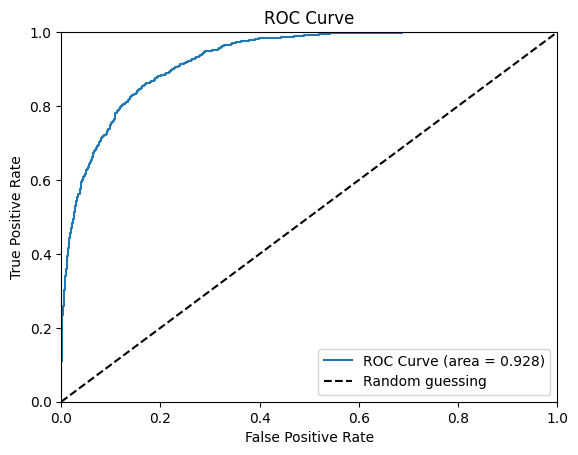

# Exam Score Classifier

**Using a logistic regression classifier to predict whether students will pass or fail an exam depending on a set of features.**

## Project overview
The objective of this project is to predict student success (Pass/Fail) based on academic habits and environmental factors. By identifying key drivers like study hours and sleep quality, we can provide early interventions for students at risk of failing.

## The data
The data for this project was obtained through a publicly available Kaggle dataset on student data for exam score prediction. The dataset can be accessed [here](https://www.kaggle.com/datasets/kundanbedmutha/exam-score-prediction-dataset). All the data is contained within a single file, Exam_Score_Prediction.csv, which can be found in the data folder of this project. The dataset included 13 columns:

| Feature | Description | Data type |
|:--- | :--- | :--- |
| student_id | Unique identifier for each student | Integer |
| age | Age of the student | Integer |
| gender | Gender of the student | String |
| course | Academic program in which the student is enrolled | String |
| study_hours | Daily study duration | Float |
| class_attendance | Attendance percentage | Float |
| internet_access | Availability of internet | Boolean |
| sleep_hours | Daily sleep duration | Float |
| sleep_quality | Quality of sleep | String |
| study_method | Primary study technique | String |
| facility_rating | Rating of the facility in which the student takes the exam | String |
| exam_difficulty | Difficulty of the exam | String |
| exam_score | Score obtained | Float |

## Development of the project
Apart from an extensive EDA portion in which both univariate and multivariate relationships were examined, the project consisted of preparing the data for building the model and then actually building and evaluating the model.

### Preparing the data
Given that a considerable portion of the regressors were categorical, the first step was to perform one-hot encoding on any of the features that were not quantitative. Then, the correlation between regressors was checked by iteratively calculating the VIF value for each of the predictors in order to determine whether any of them could be excluded to simplify the model. All VIF values were fairly low except for the internet access dummy variable, which had a VIF of 5.16. Considering that this is a dummy variable, the sample size is not particularly small, and the VIF is not too far from the threshold, the variable was kept in the model.

### Hyperparameter tuning
For the logistic regression, the model was tuned for the best accuracy score by tweaking the type of penalty (L1, L2, Elasticnet, or None) and the value of C. A grid search with cross validation was utilized to find the best model, resulting in a model with a C value of 0.1 and an L1 penalty that obtained an accuracy score of 0.837.

Given that a Lasso regularization was implemented, the coefficients of all parameters were examined to see how many (if any) were set to zero, and two of them were. Now, these two features were dummy variables, not entire categories or quantitative variables that were not encoded. The implication here being that these just have no statistical significance beyond the baseline category (which was already omitted). Beyond this, it was also possible to identify the predictors with the highest and lowest impact on the outcome variable:

**Top positive predictor:** Study hours (coefficient: 2.4)
**Top negative predictor:** Self-study as a study method (coefficient: -1.64)

### Model evaluation
After finding the hyperparameters that optimized the accuracy of the model, it was tested against the validation set to see how well it performed with unseen data. The results are shown in Table 1 below:

| Metric | Training score | Test score |
|:--- | :--- | :--- |
| Accuracy | 0.8464 | 0.8477 |
| Precision | 0.8008 | 0.7947 |
| Recall | 0.7745 | 0.7692 |
| F1 Score | 0.7844 | 0.7847 |

*Table 1: Training and test scores for the 4 evaluation metrics of the tuned model.*

The fact that the metrics remain consistent when going from the training set to the validation set suggests that the model is not overfitting the data and generalizes well to new, unseen entries. Also, despite the model being tuned for accuracy, it also performed relatively well in all other metrics. The model evaluation was taken one step further by calculating the AUC score and plotting the ROC curve, which can be seen in Figure 1 below.

*Figure 1: ROC curve and AUC score verifying the good performance of the model.*

The full analysis, including the evaluation of the model, can be found [here](exam_scores_classifier.ipynb).

## How to explore this repository
**Analysis:** View the full the analysis in the [Jupyter Notebook](exam_scores_classifier.ipynb) for full EDA and modelling.

**Utilities:** Custom functions for plotting are in [util.py](util.py).

**Reproduction:** Run `pip install -r requirements.txt` to set up the environment.